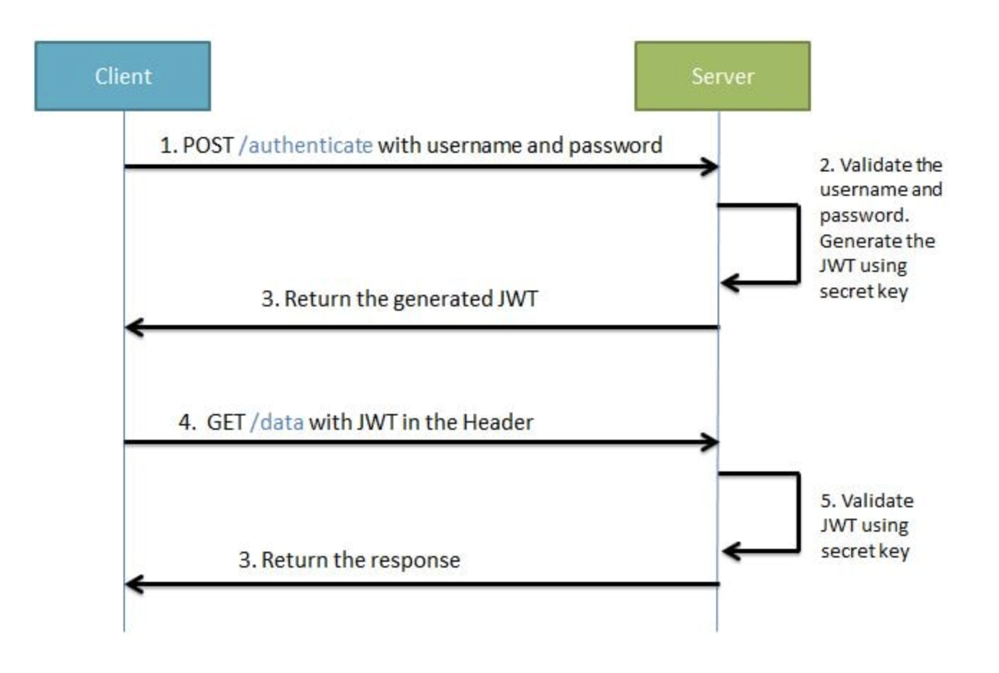

# Security JWT

JWT, or JSON Web Token, is an open standard used to share security information between two parties — a client and a
server. Each JWT contains encoded JSON objects, including a set of claims. JWTs are signed using a cryptographic
algorithm to ensure that the claims cannot be altered after the token is issued.

## How it works

JWTs differ from other web tokens in that they contain a set of claims. Claims are used to transmit information between
two parties. What these claims are depends on the use case at hand. For example, a claim may assert who issued the
token, how long it is valid for, or what permissions the client has been granted.

A JWT is a string made up of three parts, separated by dots (.), and serialized using base64. In the most common
serialization format, compact serialization, the JWT looks something like this: `xxxxx.yyyyy.zzzzz`.

Once decoded, you will get two JSON strings:

1. The header and the payload.
2. The signature.

### The header contains info on how the JWT is encoded. 
### The body is the meat of the token (where the claims live). 
### The signature provides the security.

A common way to use JWTs is as `OAuth` bearer tokens. In this example, an authorization server creates a JWT at the
request of a client and signs it so that it cannot be altered by any other party. The client will then send this JWT
with its request to a REST API. The REST API will verify that the JWT’s signature matches its payload and header to
determine that the JWT is valid. When the REST API has verified the JWT, it can use the claims to either grant or deny
the client’s request.

In simpler terms, you can think of a JWT bearer token as an identity badge to get into a secured building. The badge
comes with special permissions (the claims); that is, it may grant access to only select areas of the building. The
authorization server in this analogy is the reception desk — or the issuer of the badge. And to verify that the badge is
valid, the company logo is printed on it, similar to the signature of the JWT. If the badge holder attempts to access a
restricted area, the permissions on the badge determine whether they can access the area, similar to the claims
in a JWT.

Online generator: https://www.javainuse.com/jwtgenerator